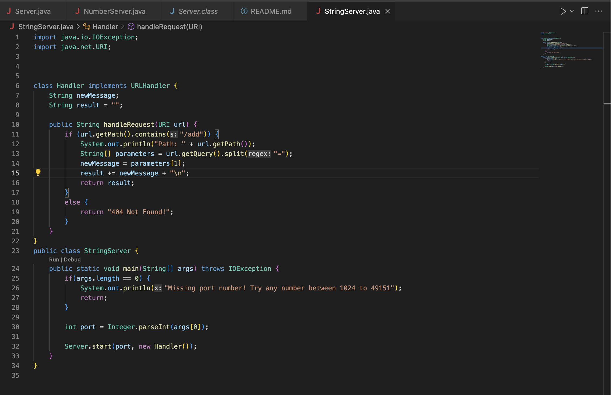
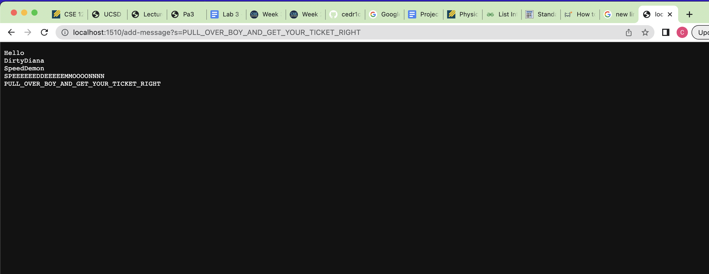
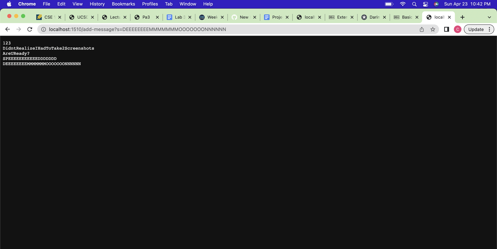
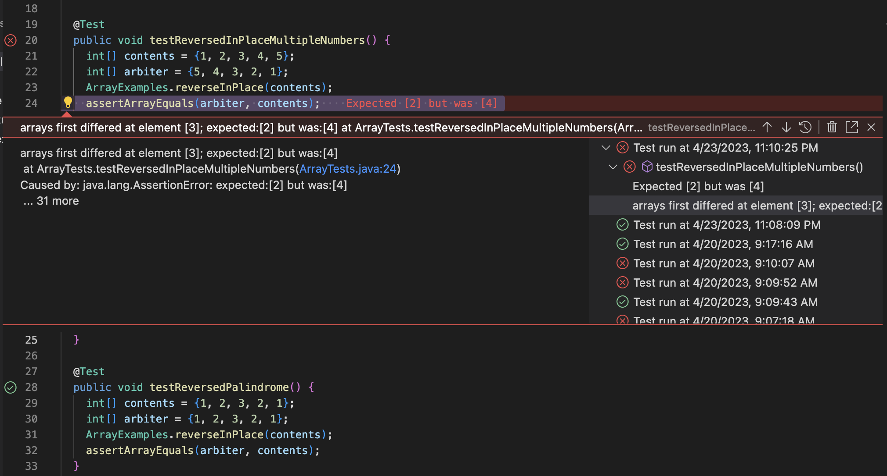

**Lab Report 2**

**Part 1**

Here is a screenshot of my code for StringServer.

I only used one method to make StringServer, which is the handleRequest method. The handleRequest method is able to take a string and print it. The argument for this method is the url. It takes the url and splits it, making sure it turns the query into a string. It then adds that string to a string variable which keeps track of all the strings. The "newMessage" variable stores the new message fro the query. It will completely change for each query. The "result" variable is a running record off all the messages added to the server. Each query will add the string for "newMessage" to "result". Just changing the counter which keeps track of an integer to a string.

Here are two examples of the StringServer running. As you can see Michael Jackson's Speed Demon was playing while I was testing the server.

**Part 2**

For part 2 of this lab report I choose to report on the reverseInPlace method.

The following JUnit test causes the method to fail.

    @Test
    public void testReversedInPlaceMultipleNumbers() {
      int[] contents = {1, 2, 3, 4, 5};
      int[] arbiter = {5, 4, 3, 2, 1};
      ArrayExamples.reverseInPlace(contents);
      assertArrayEquals(arbiter, contents);
    }

The following JUnit Test does not cause a failure.

    @Test
    public void testReversedInPlaceMultipleNumbers() {
      int[] contents = {1, 2, 3, 2, 1};
      int[] arbiter = {1, 2, 3, 2, 1};
      ArrayExamples.reverseInPlace(contents);
      assertArrayEquals(arbiter, contents);
    }
    
The following screenshot is the two tests being run on the original method.

Here are the changes made to the method to fix the bug.

Before

    static void reverseInPlace(int[] arr) {
      for(int i = 0; i < arr.length - 1; i+= 1) {
      arr[i] = arr[arr.length - i - 1];
      }
    }

After

    static void reverseInPlace(int[] arr) {
      int temp = 0;
      for(int i = 0; i < arr.length / 2; i+= 1) {
      temp = arr[i];
      arr[i] = arr[arr.length - i - 1];
      arr[arr.length - i - 1] = temp;
      }
    }
    
The problem this method poses is clever because a simple solution could be to just copy the current array to a new one, and then reverse the values using the new array that was created. But this approach would be very similar to the method that comes directly after it. So what this change does is just keeps track of one element in the array called "temp". It then uses "temp" to swap two elements in the array at once. Meaning we only have to iterate halfway through the array.

**Part 3**

The biggest thing I've learned from labs 2 and 3 is how to start a web server. If you asked me to start a web server 2 weeks ago I would have no clue where to start. I found that when I was aksed to create a web server for part 1 of this lab report I was referring to the NumberServer file we were provided often. Sometimes even copying bits of code that were useful.
