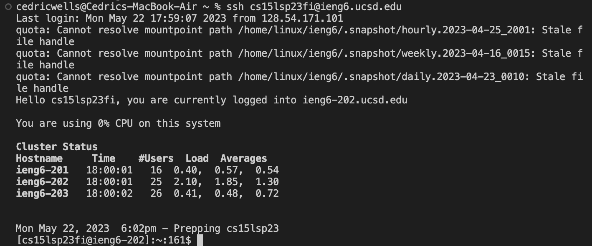
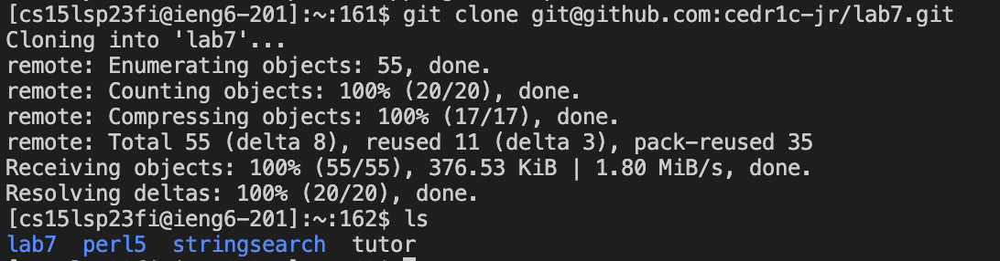
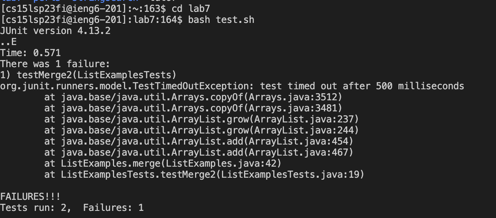
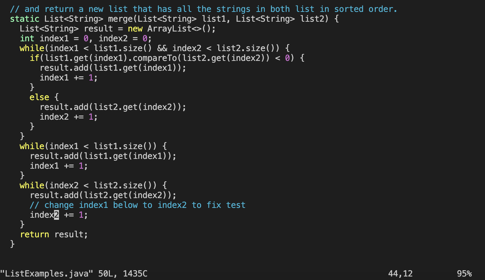
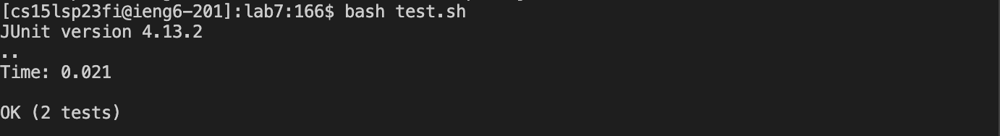
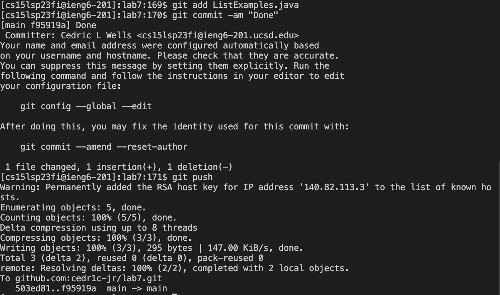
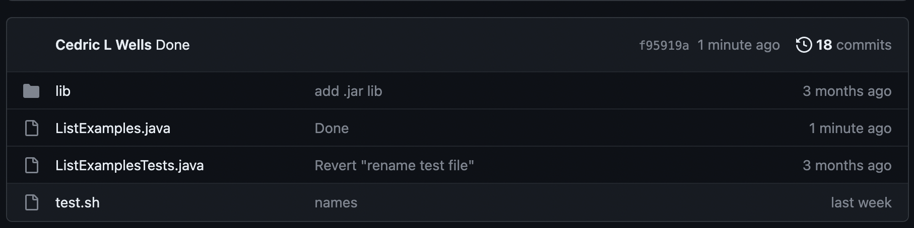

**Lab Report 4**

**Step 1: Logging in to the remote server**

**Key Presses**

    ssh cs15lsp23fi@ieng6.ucsd.edu 
    <ENTER>
  
This command logs me into my account on the remote server.

**Step 2**

**Key Presses**

    git clone <CTRL + V>
    <ENTER>
    
I had the ssh from the lab7 repository copied to my clipboard. Ctrl + V pastes the ssh into the terminal.

    ls
    <ENTER>
    
This command lists the directories in the current working directory. This is to double check that the repository was
cloned correctly.

**Step 3**

**Key Presses**

    cd lab7
    bash test.sh
    
The first command changes the working directory to lab7. This was we can access the files inside lab7 easier.
The second command runs the tests using the shell file test.sh which contains:

    javac -cp .:lib/hamcrest-core-1.3.jar:lib/junit-4.13.2.jar *.java
    java -cp .:lib/hamcrest-core-1.3.jar:lib/junit-4.13.2.jar org.junit.runner.JUnitCore ListExamplesTests
    
**Step 4**

**Key Presses**

    vim ListExamples.java
    
This command opens the file in our terminal allowing us to edit it. 

    6 <UP>
    11 <RIGHT>
    X
    I
    2
    <CTRL + C>
    <CTRL + C>
    :wq
    
We got a few command to go through here so I will be referring to them as commands 1-8 to better associate the
explanations with the commands.

Commands 1-2: These are used to navigate to the part we need to edit. I had to personally use the up and right arrow keys their
respective number of times so I could count them. But following the exact key presses above will achieve the same result.

Commands 3-5: These are used to actually edit the error. "X" removes the character at the cursor. "I" brings up the insert option. Which allows us to press "2" to change the piece of code to read "index2".

Command 6: This is the first CTRL + C. This is to exit the "insert" mode in the vim editor. Important note, this is only for Mac.
Windows users should substitute CTRL + C for ESC.
  
Command 7: The second CTRL + C. This is to exit the navigator of vim editor and allow us to enter keys.
  
Command 8: The last command. Saves the changes to the file and exits the vim editor.
  
**Step 5**

**Key Presses**

    bash test.sh
    
Same as in step 3.

**Step 6**

**Key Presses**
  
    git add ListExamples.java
    git commit -am "Done"
    git push
    
The first command adds the ListExamples.java file to be included in the next commit. Doesn't make any changes to the repository though.
The second command actaully makes changes to provides the commit message.
Finally, git push pushes the changes to the repository on github.
