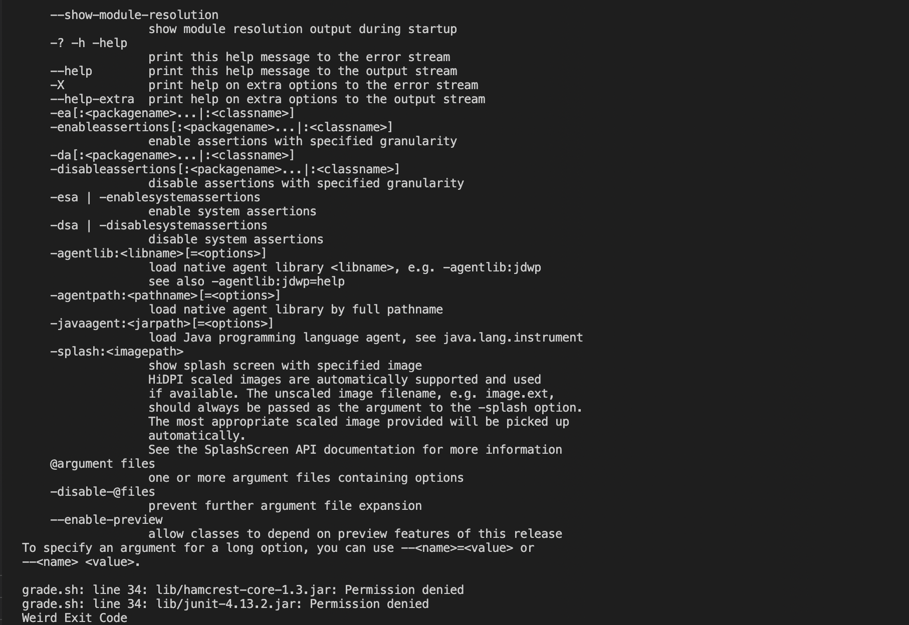
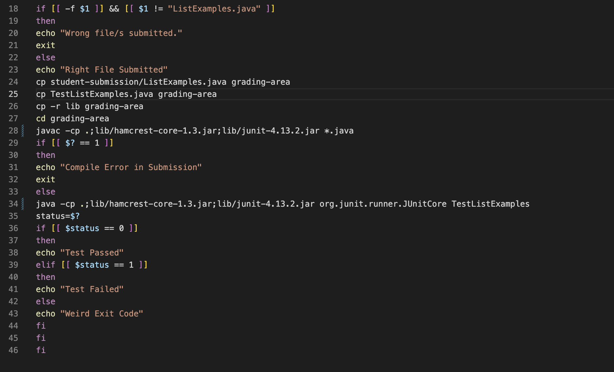

**Lab Report 5**

**Ed Stem Post**

**Grade.sh file not working**

**What environment are you using (computer, operating system, web browser, terminal/editor, and so on)?**

Macbook using VSCode

**Detail the symptom you're seeing. Be specific; include both what you're seeing and what you expected to see instead. 
Screenshots are great, copy-pasted terminal output is also great. Avoid saying “it doesn't work”.**

I'm getting a really big error that brings up a whole manual with options. When I try and compile and run the tester with JUnit it says "Permission denied".
I'm using the repository that should have no errors so I don't know why it's failing. It works when other people on different machines run it but not mine.

**Detail the failure-inducing input and context.
That might mean any or all of the command you're running, a test case, command-line arguments, working directory, even the last few commands you ran.
Do your best to provide as much context as you can.**

My working directory is list-examples-grader.
The command I used was:
bash grade.sh https://github.com/ucsd-cse15l-f22/list-methods-corrected

**TA Response**

It looks like you're using Windows syntax in your JUnit commands. Try changing the semicolons to colons in lines 28 and 34.

**Conclusion**

This example uses the grade.sh and list-examples-grader repository from earlier labs.
Here is the file structure when the bug was triggered.

Here is the command line that triggered the bug.

    bash grade.sh https://github.com/ucsd-cse15l-f22/list-methods-corrected
    
To fix the bug, all that was needed was to replace the semicolons in lines 28 and 34 with colons.

**Part 2**
I think the coolest thing I learned from the second half of this quarter was how to use github to use and edit other people's code.
Before I started this class I always thought using GitHub was kind of scary. I didn't know what it was and I was hesitant to setup and account. But after learning how to use it and GitHub desktop I see how useful it is and how it's not really all that scary.
