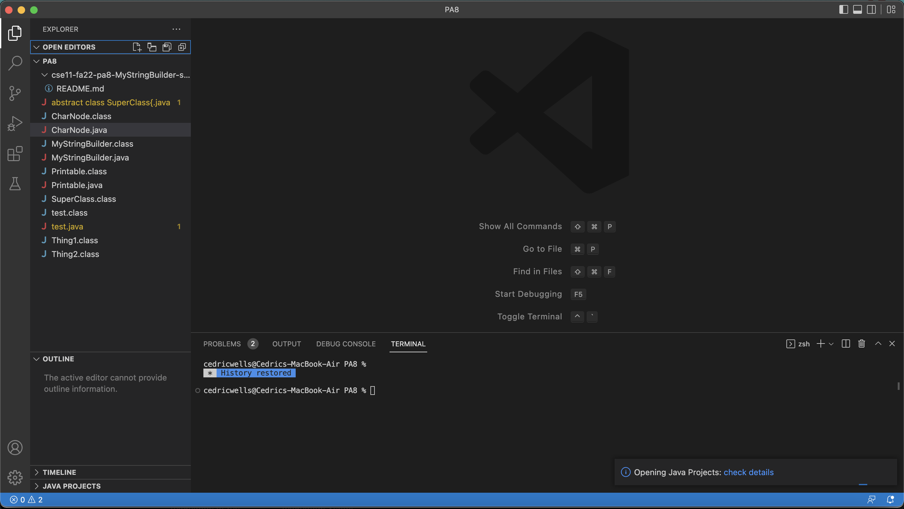
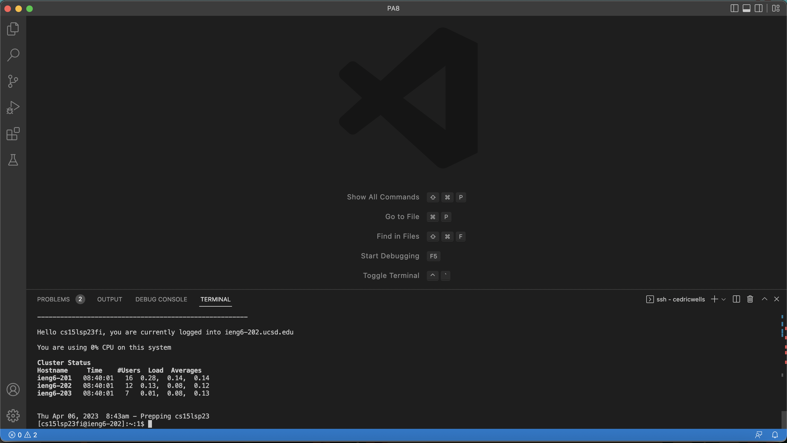
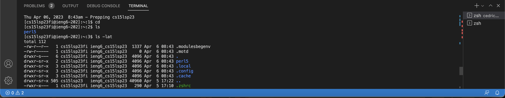

I already had VSCode installed. Unfortunately I wasn't on the home screen but this is an example of what VSCode might look like.

Password section does not show what you’re typing, you just need to believe in your typing skills. My two letters that replace zz changed after changing my password.

Just playing around with some commands. Typing just cat while in the home directory makes something weird happen where the terminal will just spit back out whatever you type in.
